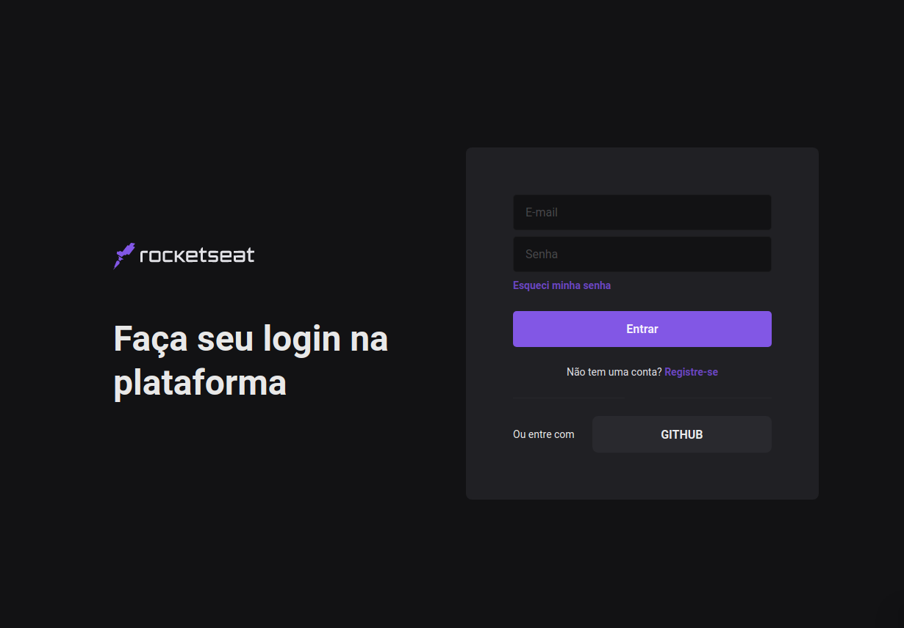

<p align="center">
   
</p>

> :rocket: Projecto reacriando tela de login da @Rocketseat

### Projeto 

<div>
    
</div>

## 👨‍💻️ Tecnogias utilizadas

- [NextJs](https://nextjs.org/)
- [Chakra](https://chakra-ui.com/)
- [TypeScript](https://www.typescriptlang.org/)
- [ReactJS](https://reactjs.org/)

### Run Web

```bash

$ cd SkylabLoginPàge

# Install Dependencies
$ yarn install

# Run Aplication
$ yarn start
```
Go to http://localhost:3000/ to see the result.
